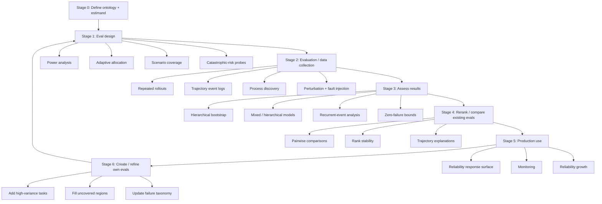

# Statistical Rigor for Agentic Evals

## 1. Answer First

Agentic evals should be treated as **stochastic, clustered, trajectory-valued reliability studies**, not as flat IID benchmark scores.

That means an eval is a measurement protocol over a full system: model, harness, tools, environment, tasks, rollouts, trajectories, and events. The goal is not only to report a final success rate. The goal is to understand what population the score represents, how uncertain it is, where variance comes from, what failure modes recur, and how to spend the next eval budget.

This framing extends the ordinary statistical view of language-model evals. Miller argues that evals should be treated as statistical experiments with uncertainty intervals, pairwise comparisons, and power planning ([Miller, 2024](https://arxiv.org/abs/2411.00640)). Agentic evals need the same discipline, but the data are richer and less IID: tasks are clustered, rollouts are repeated, judges and simulators can be noisy, and outcomes depend on trajectories through tools and state.

The protocol below has three pieces:

1. **Ontology:** define the objects being measured: system, task, rollout, trajectory, event.
2. **Instrumentation:** log the core fields needed for comparison, plus conditional/eval-specific fields for diagnosis.
3. **Pipeline:** design the eval, collect trajectories, assess uncertainty, explain failures, and decide the next measurement step.

## 2. Ontology / Universe of Measurement

The ontology defines the objects and relations the eval measures, so later statistics have a clear unit of inference.

Define the system under test as:

```text
S = M x H x E

M = model
H = harness/scaffold: prompting, memory, retry policy, planner, tool wrapper
E = tools/environment: APIs, database, browser, simulator, state, policies
```

Define the eval structure as:

```text
B -> C -> T -> R -> tau -> e

B    = benchmark or eval suite
C    = domain / scenario cluster / workflow family
T    = task instance
R    = rollout or sampled run of S on T
tau  = full trajectory for one rollout
e    = event or step inside the trajectory
```

Example:

```text
M    = Claude / GPT / Llama / Qwen
H    = ReAct scaffold + retry policy + memory + prompt template
E    = customer-service tools + database + user simulator
B    = tau2-style customer-service eval or company workflow eval
C    = airline refunds / account changes / retail returns
T    = one concrete user request with initial state and policy constraints
R    = one stochastic run with fixed decoding params and versions
tau  = ordered user-agent-tool-environment trace
e    = message, tool call, tool result, tool error, state mutation, check, retry
```

This ontology matters because different claims require different units of inference. A score over 500 rollouts is not necessarily evidence over 500 independent tasks. Repeating 10 tasks 50 times mostly measures rollout variance on those 10 tasks. Adding 500 distinct tasks measures the task population better. Logging only final success loses the evidence needed to diagnose why systems differ.

Recent agent benchmarks already point in this direction. For example, tau2-bench evaluates conversational agents in a shared environment where user and agent can both affect state, which makes final outcomes depend on coordination, tool use, and state transitions rather than one static answer ([tau2-bench](https://arxiv.org/abs/2506.07982)).

## 3. Log Schema: Core + Extensions

The log schema is recommended instrumentation, not a universal mandatory schema. Core fields support comparability; extensions support diagnosis when the eval design can identify them.

A **core + extensions log schema** means: keep a small stable core across evals, then add conditional or eval-specific fields only when they answer a concrete measurement question. The core should be stable across evals. Conditional and eval-specific fields depend on whether the benchmark uses judges, simulators, observable state, safety labels, or domain-specific policies.

### Core Fields

Core fields are the minimum needed to estimate score uncertainty, preserve pairing, and reconstruct ordered trajectories.

Rollout-level core:

```text
run_id
benchmark_id
task_id
system_id
model_id
harness_id
tool_environment_version
seed
temperature / decoding params
date / API version / model snapshot
final_outcome
cost
latency
timeout_flag
```

Trajectory-level core:

```text
run_id
event_id
timestamp or step_index
actor: user / agent / tool / judge / environment
event_category
event_type
tool_name, if applicable
event_cost
event_latency
```

Use two-level event typing:

```text
event_category = message | tool | state | check | error | control | intervention | safety
event_type     = eval-specific finer label
```

For example, `event_category = tool` could include `event_type = tool_call`, `tool_result`, or `tool_timeout`. A safety eval might add `unsafe_tool_attempt`; a customer-service eval might add `refund_policy_check`.

### Conditional Fields

Add these when the eval design can support them:

```text
scenario_cluster / domain
simulator_id
judge_id / verifier_id
expert_label_id
state_before / state_after, if observable
state_mutation_flag
error_flag
policy_violation_flag
recovery_flag
judge_confidence
simulator_profile
```

### Eval-Specific Extensions

Add benchmark- or product-specific labels only when they answer a concrete measurement question:

```text
domain taxonomy labels
workflow step labels
safety / side-effect taxonomy
policy-specific violation labels
business severity label
customer-impact label
near-miss label
```

Example `event_type` values:

```text
agent_message, user_message, tool_call, tool_result, tool_error,
state_mutation, verification_check, policy_check, retry, loop,
timeout, manual_intervention, unsafe_or_catastrophic_event
```

The schema should be treated as part of the measurement instrument. If a failure mode is not logged, it can still affect the score, but it cannot be attributed, modeled, or used to improve the eval.

## 4. Goals and Questions

The framework should answer four decision questions: how uncertain the score is, why failures happen, how to spend the next eval budget, and what production-reliability evidence would require.

### Goal A: Estimate Uncertainty of Final Scores

Questions:

- What is the score over the target task population?
- How wide is the uncertainty interval?
- Is `S1` meaningfully better than `S2`?
- How stable is the ranking under task/domain resampling?

| Method | Area / source discipline | Rationale / example |
| --- | --- | --- |
| Hierarchical bootstrap | Resampling / clustered inference | Resample scenario clusters/tasks first, then rollouts, to avoid treating repeated runs as independent tasks. |
| Paired comparisons | Experimental design / comparative inference | Compare `S1` and `S2` on the same task distribution so task difficulty cancels where possible. |
| Mixed or Bayesian hierarchical models | Hierarchical modeling | Estimate system effects while accounting for task, domain, rollout, judge, or simulator variation. |
| Multiple-comparison correction | Simultaneous inference | Avoid overclaiming when comparing many systems or many pairwise gaps. |
| Simulation-based power analysis | Clinical trial design / experimental design | Estimate whether a proposed budget can detect `Delta >= delta_min`. |

### Goal B: Explain Variance and Failure Modes

Questions:

- Which tasks, domains, or workflow clusters cause instability?
- Which trajectory events predict failure?
- Are failures random, clustered, or process-specific?
- Does the same final score hide different reliability profiles?

| Method | Area / source discipline | Rationale / example |
| --- | --- | --- |
| Variance decomposition | Hierarchical modeling | Estimate whether instability comes from tasks, domains, rollouts, judges, simulators, or system-by-task interactions. |
| Recurrent-event models | Recurrent-event analysis / survival analysis | Model repeated tool errors, retries, loops, policy checks, or wrong state mutations inside `tau`. |
| Trajectory features | Event-log analysis / feature engineering | Convert traces into predictors such as `tool_error_count`, `loop_flag`, or `state_mutation_before_check`. |
| Process discovery and conformance checking | Process mining | Discover common trajectories and compare observed paths to intended workflow or policy. |
| Failure taxonomies | Error analysis / benchmark design | Separate final task failure, side effect, policy violation, wrong state mutation, and catastrophic failure. |
| Ablations, perturbations, and stress tests | Reliability engineering / robustness evaluation | Test whether failures depend on scaffold components, wording changes, tool faults, or degraded environment state. |

### Goal C: Improve Future Eval Design

Questions:

- Should the next budget buy more tasks, rollouts, judges, domains, perturbations, or stress cases?
- Which task clusters are redundant?
- Which scenario regions are uncovered?
- Which trajectory logs are worth collecting?
- What minimum detectable effect matters for product decisions?

| Method | Area / source discipline | Rationale / example |
| --- | --- | --- |
| Power analysis | Clinical trial design / experimental design | Choose task/run/judge counts for a practically meaningful effect size. |
| Adaptive eval design | Adaptive trials / sequential design | Use pilot variance to decide whether the next budget buys more tasks, rollouts, judges, or stress cases. |
| Scenario coverage | Benchmark design | Ensure domains, task types, user behaviors, tool states, and risk profiles are represented. |
| Active task selection | Active learning / optimal design | Add tasks where uncertainty, failure rate, or decision value is highest. |
| Held-out region testing | Generalization / benchmark design | Test scenario regions not used to tune prompts, scaffolds, or policies. |
| Degradation testing | Reliability engineering | Measure how performance decays under harder task conditions or degraded environment state. |

HELM is the relevant precedent for scenario and metric coverage: evals should cover meaningful scenarios and desiderata rather than collapse everything into one scalar too early ([HELM](https://arxiv.org/abs/2211.09110)). BetterBench makes the same point from the benchmark-quality side: benchmark design, statistical reporting, and reproducibility are part of eval rigor, not afterthoughts ([BetterBench](https://arxiv.org/abs/2411.12990)).

### Goal D: Support Future Production Reliability

Questions:

- How does `S = M x H x E` respond to controlled changes?
- How does reliability degrade under semantic perturbations or tool faults?
- What is the upper bound on catastrophic failure probability?
- Are new versions improving, overfitting, or shifting failure modes?

| Method | Area / source discipline | Rationale / example |
| --- | --- | --- |
| Reliability demonstration testing | Reliability engineering | Support claims like failure probability below a threshold under stated assumptions. |
| Zero-failure upper bounds | Rare-event inference | If no catastrophic failures are observed, report an upper confidence bound rather than "safe." |
| Fault injection | Robustness / reliability engineering | Inject tool/API/environment faults and estimate how `S = M x H x E` responds. |
| Degradation/stress testing | Stress testing / robustness | Increase task or environment difficulty and estimate reliability decay. |
| Reliability growth models | Reliability engineering / monitoring | Track whether new versions reduce failures or shift them elsewhere. |
| Statistical process control | Quality monitoring | Monitor production event rates for drift, regressions, or out-of-control failure modes. |
| Production event-log monitoring | Observability / process mining | Use production traces to update eval tasks and detect workflow deviations. |

This is future work for the memo, but it should shape the ontology now. Production reliability claims require evidence about the whole `M x H x E` system, not just model-level leaderboard scores.

## 5. Process Overview

The pipeline is cyclic: each eval should produce both a result and evidence for improving the next eval design.



## 6. Stage-by-Stage Protocol

Each stage should start from the claim it supports, then choose methods that match the available unit of evidence.

### Stage 0: Define Ontology and Estimand

**Claim.** We cannot choose a valid uncertainty method until we define the system, task population, and target quantity.

**View.** An eval is not "run model on tasks." It is a measurement protocol over:

```text
S x C x T x R x tau x e
```

**Main questions.**

- What full system are we measuring: model only, or `M x H x E`?
- What task/scenario population do we claim to represent?
- What is the unit of inference: task, rollout, domain, event, or deployment workflow?
- What counts as success, failure, near miss, side effect, and catastrophic failure?
- Are judge and simulator behavior part of the system, the measurement process, or both?

**Methods.**

- estimand definition;
- task/scenario taxonomy;
- metric vector definition;
- composite endpoint definition;
- core-plus-extensions log schema.

An **estimand** is the exact quantity the eval claims to estimate. A **metric vector** is the set of outcomes reported together, rather than one scalar success score: final success, policy compliance, state safety, cost, latency, recurrent errors, and catastrophic or near-miss events.

**Example.** Comparative estimand over a target task distribution `D`:

```text
Y(S, T, R) = 1 if rollout R of system S on task T succeeds

score(S; D) = E_T~D E_R[Y(S, T, R)]
Delta = score(S1; D) - score(S2; D)
```

Production-style future-work estimand:

```text
P(catastrophic_state_mutation | S, D_company) < q
```

The first estimand supports comparison. The second supports reliability claims. They require different designs.

### Stage 1: Eval Design

**Claim.** Eval design is where we decide what evidence the budget can buy.

**View.** Design the eval like a clustered experiment and, when relevant, a reliability study. Tasks/domains are clusters. Rollouts are repeated measurements. Judges and simulators are noisy assessors. Trajectory events are longitudinal observations. Catastrophic failures are rare-event outcomes, not ordinary errors.

**Main questions.**

- How should we spend the eval budget?
- How many tasks vs. rollouts?
- How many domains/scenario clusters?
- Do we need repeated judges or expert calibration labels?
- Which perturbations, stress cases, or known-bad outcomes should be probed?
- What minimum detectable effect is practically meaningful?

**Methods.**

1. **Simulation-based power analysis.** Area: experimental design / statistical power for evals. Source: Miller's eval framing explicitly includes power planning for model evaluations ([Miller, 2024](https://arxiv.org/abs/2411.00640)). Use pilot data to estimate task variance, rollout variance, and judge/simulator variance. Simulate candidate designs and choose the design that can detect the smallest practically relevant effect.

```text
Candidate A: 200 tasks x 1 rollout
Candidate B: 50 tasks x 4 rollouts
Candidate C: 40 tasks x 3 rollouts x 2 judges

Choose based on power for Delta >= delta_min and width of CI(score).
```

2. **Adaptive eval design.** Area: adaptive trials / sequential experimental design. Treat adaptive design as core, not future work. After a pilot, allocate remaining budget to the variance source that limits the decision.

```text
If task variance dominates: add tasks or scenario clusters.
If rollout variance dominates: add repeated runs/seeds.
If judge variance dominates: add judge repeats or expert labels.
If domain uncertainty dominates: add undercovered domains.
If rare-risk uncertainty dominates: add targeted probes/stress cases.
```

Guardrail: adaptation rules should be pre-specified, or the result should be labeled exploratory. Adaptive clinical-trial methods are useful because they show how to modify sampling during a study while preserving validity when the rules are planned and controlled ([adaptive design review](https://pmc.ncbi.nlm.nih.gov/articles/PMC5868584/)).

3. **Scenario coverage.** Area: benchmark design / coverage. Source: HELM motivates scenario and metric coverage for broad LM evaluation ([HELM](https://arxiv.org/abs/2211.09110)). Define scenario as:

```text
scenario = domain + task type + user behavior + tool state + risk profile
```

Coverage matters because a narrow task distribution can create false confidence. A score from easy/refund workflows may not generalize to account-closure or high-risk state-mutation workflows.

4. **Catastrophic-risk design.** Area: rare-event reliability / stress-test design. If a bad outcome is plausible, do not wait for ordinary random evals to encounter it. Add targeted probes, adversarial or stress scenarios, and explicit rare-event bounds. Define near misses as observable precursor events, for example: unsafe tool call attempted but blocked, wrong state mutation proposed but not committed, policy check skipped, or recovery only after simulator intervention.

### Stage 2: Evaluation / Data Collection

**Claim.** The final outcome is only interpretable if the trajectory and versions are logged well enough to explain it.

**View.** Run the eval as a structured data-collection process. The final outcome is one endpoint. The trajectory is the evidence.

**Main questions.**

- Do we get repeated rollouts per task?
- Do we log trajectory events consistently?
- Do we record judge/simulator identity and versions?
- Do we run perturbation, degradation, or fault-injection conditions?
- Do logs preserve enough state to explain failure?

**Methods.**

1. **Repeated rollouts.** Area: repeated-measures evaluation / reliability estimation. For task `T_i` and system `S_j`, run:

```text
R_ij1, R_ij2, ..., R_ijK
```

This distinguishes a system that usually succeeds from one that sometimes succeeds. It also supports pass-attempt analyses, but `pass^k` should not be confused with ordinary per-run reliability: it asks whether repeated attempts can eventually produce success.

2. **Recurrent-event logging.** Area: event-history / count-process measurement. Track repeated events inside `tau` by broad `event_category` and, where useful, benchmark-specific `event_type`:

```text
tool_error_count
retry_count
loop_count
policy_check_count
wrong_state_mutation_count
recovery_count
```

These are not just labels. They become outcomes or covariates for failure analysis.

3. **Process mining as trajectory discovery.** Area: process mining / event-log analysis. Treat trajectories as event logs. Process discovery asks: what paths do agents actually take? Conformance checking asks: where do observed trajectories deviate from intended workflow or policy? These methods are natural for agent traces because process mining is built around event logs, discovered process variants, and conformance to expected processes ([process discovery overview](https://www.processmining.org/process-discovery.html), [conformance-checking survey](https://arxiv.org/abs/1909.02393)).

Outputs:

```text
common successful variants
common failed variants
missing verification steps
tool-use loops
state mutation before policy check
deviation from expected workflow
```

Then feed these features into mixed models, recurrent-event analyses, or failure taxonomies. Broad `event_category` supports cross-benchmark comparison; finer `event_type` supports benchmark-specific diagnosis.

4. **Perturbation, degradation, and fault injection.** Area: robustness and reliability engineering. These test how `S = M x H x E` responds to controlled changes:

```text
semantic perturbation: same intent, varied wording / distractors / missing fields
environment degradation: latency, stale state, partial observability
tool fault: API error, schema drift, invalid result, timeout
```

ReliabilityBench is relevant here because it evaluates repeated attempts, semantic perturbations, and tool/API fault injection as production-like reliability conditions ([ReliabilityBench](https://arxiv.org/abs/2601.06112)).

5. **Catastrophic-failure probes.** Area: rare-event stress testing. For known bad outcomes, add targeted tasks and stressors designed to expose the failure path. If simulation is available, adaptive stress testing can search for likely trajectories to failure states instead of relying on random sampling to find rare events ([Adaptive Stress Testing](https://arxiv.org/abs/1811.02188)).

### Stage 3: Assess Results

**Claim.** Assessment should estimate uncertainty at the right clustering level and explain variance through the ontology.

**View.** Estimate uncertainty at the correct clustering level and explain variance through the ontology.

**Main questions.**

- What is the uncertainty interval for the score?
- Are two systems meaningfully different?
- Which domains/tasks drive the difference?
- Which trajectory features predict failure?
- What can we say about catastrophic failures if none were observed?

**Methods.**

1. **Hierarchical bootstrap.** Area: bootstrap resampling / clustered uncertainty estimation. Source: bootstrap inference originates with Efron's jackknife/bootstrap work, and cluster bootstrap variants are designed for nested or clustered data ([Efron, 1979](https://marine.gov.scot/sma/content/bootstrap-methods-another-look-jackknife), [ClusterBootstrap paper](https://pmc.ncbi.nlm.nih.gov/articles/PMC7148287/)). Resample scenario clusters/tasks first, then rollouts within tasks. Preserve pairing when systems are evaluated on the same tasks.

```text
For b in 1..B:
  sample clusters C* with replacement
  sample tasks T* within C*
  sample rollouts R* within T*
  compute score_b(S), Delta_b, rank_b

Report CI(score), CI(Delta), P(rank(S)=1), P(S in top-k).
```

This avoids pretending that many rollouts from the same task are independent task evidence.

2. **Mixed / hierarchical models.** Area: generalized linear mixed models / longitudinal binary data. Source: GLMMs are standard for binary outcomes with repeated or clustered observations ([GLMM longitudinal binary data](https://pmc.ncbi.nlm.nih.gov/articles/PMC3082943/)). Use when we want variance decomposition, not just uncertainty intervals.

```text
logit P(Y_ijr = 1) = alpha
                    + beta_system[j]
                    + u_task[i]
                    + u_domain[c[i]]
                    + u_system_task[j,i]
                    + gamma * trajectory_features[ijr]
```

Use this to estimate system effects, task/domain difficulty, model-by-task interaction, and associations between trajectory features and outcomes. Add judge/simulator random effects only when the design has enough repeated labels to identify them.

3. **Recurrent-event analysis.** Area: recurrent-event / event-history / count modeling. For events such as retries, tool errors, loops, skipped checks, or wrong state mutations, model counts or rates in addition to final success.

```text
E[tool_errors | S, T, R] = f(system, domain, task difficulty, tool condition)
```

This helps distinguish systems with the same final success rate but different reliability profiles.

4. **Composite endpoints plus component metrics.** Area: endpoint design / multi-metric reporting. A strict endpoint is useful:

```text
success_strict = final_success
                 AND no_policy_violation
                 AND no_wrong_state_mutation
                 AND cost <= budget
```

But report the components too:

```text
final_success
policy_compliance
state_safety
cost
latency
recurrent_errors
```

A composite can hide whether a system improved by solving more tasks or merely got cheaper while increasing side effects.

5. **Judge/simulator calibration.** Area: measurement-system calibration / evaluator reliability. If LLM judges or user simulators are used, treat them as measurement instruments. Track judge identity, simulator identity, disagreement, bias against expert labels, and variance across repeated judgments. AgentRewardBench is relevant because it evaluates automatic/LLM judges for web-agent trajectories with labels for success, side effects, and repetitiveness ([AgentRewardBench](https://arxiv.org/abs/2504.08942)).

6. **Catastrophic-failure assessment.** Area: rare-event inference / reliability demonstration. Zero observed catastrophic failures does not mean safe. It means the eval did not observe a catastrophic failure under its sampled distribution. The common "rule of three" for zero observed events is discussed by Hanley and Lippman-Hand ([1983](https://www.med.mcgill.ca/epidemiology/hanley/tmp/Proportion/zero_numerator.pdf)).

If `n` independent representative runs produce zero catastrophic failures, a rough 95% upper bound is:

```text
p_cat <= 3 / n
```

So 0 catastrophic failures in 300 independent runs supports roughly `p_cat <= 1%`, not `p_cat = 0`. This bound is only as credible as the independence and representativeness assumptions. Report catastrophic failures separately from ordinary task failures, and report near misses or stress-triggered failures as leading indicators.

### Stage 4: Reranking Existing Evals

**Claim.** Existing leaderboards can be reinterpreted by asking which ranks survive task/domain resampling.

**View.** This is optional but useful: use existing benchmark logs/traces to show whether point-estimate rankings survive uncertainty correction and trajectory diagnostics.

**Main questions.**

- Do leaderboard ranks survive task-clustered uncertainty?
- Are differences practically meaningful?
- Which domains/tasks drive rank changes?
- Which trajectory patterns explain instability?

**Methods.**

- hierarchical bootstrap over tasks/domains to produce rank distributions under resampling;
- task-clustered confidence intervals;
- paired pairwise comparison matrix;
- bootstrap rank distribution;
- mixed-effects variance decomposition;
- trajectory/process features explaining rank instability.

Possible tau2-bench project:

```text
Input: per-run task outcomes and traces from a tau2-style benchmark.
Output: uncertainty-aware rank distribution + trajectory failure explanation.

Question:
How much of the leaderboard survives task-clustered uncertainty,
and what trajectory-level failure modes explain instability?
```

This should be framed as one possible next step, not the main memo frame.

### Stage 5: Production Use (Future Work / Extension)

**Claim.** Production reliability is a claim about how the whole system responds to changes, not just how it scored once.

**View.** Production asks how `S = M x H x E` behaves under changes, not only how it ranks on a benchmark.

**Main questions.**

- Does reliability hold under repeated attempts?
- Does performance degrade under semantic perturbations?
- Does the system tolerate tool/API faults?
- Are new versions improving or overfitting?
- Is the observed failure rate acceptable for the workflow risk?

**Methods.**

Use a response-surface framing. Area: reliability engineering / robustness evaluation. ReliabilityBench uses repeated attempts, perturbations, and tool/API fault conditions to summarize production-like agent reliability ([ReliabilityBench](https://arxiv.org/abs/2601.06112)):

```text
R_S(k, epsilon, lambda)

k       = repeated attempts / rollouts
epsilon = semantic perturbation intensity
lambda  = tool/API/environment fault intensity
```

Then estimate how success, safety, cost, latency, and recurrent failures change as `k`, `epsilon`, or `lambda` change.

Additional production methods:

- reliability demonstration testing;
- zero-failure bounds for rare unacceptable outcomes;
- degradation testing;
- fault injection;
- reliability growth over versions;
- statistical process control over production event logs.

This is not ordinary leaderboard scoring. It is deployment-risk evidence.

### Stage 6: Creating / Refining Own Evals

**Claim.** A company eval should be maintained as a measurement system, not treated as a static dataset.

**View.** A company eval should be a continuously maintained measurement system.

**Main questions.**

- Which high-variance tasks should be expanded?
- Which scenario regions are uncovered?
- Which production traces should become eval tasks?
- Which failure modes need new labels, checks, or probes?
- Which logs are missing for future diagnosis?

**Methods.**

- task coverage map;
- high-variance task queue;
- production-trace sampling;
- failure taxonomy updates;
- process-deviation mining;
- verifier/rubric calibration;
- versioned benchmark changelog.

The output of this stage cycles back into eval design.

## 7. Potential Next Steps

These are possible workstreams, not a ranked priority list.

Option A: **Protocol refinement.** Formalize the ontology, log schema, estimands, and stage-by-stage method map into an agreed eval protocol.

Option B: **tau2-style reranking study.** Use an existing agent benchmark with per-run outcomes/traces, then compute task-clustered uncertainty, pairwise rank stability, and trajectory-level explanations. This is the most concrete empirical next step.

Option C: **Company eval design.** Pick one company-relevant workflow family, define scenario clusters, construct the core-plus-extensions log schema, run a pilot, and use adaptive design to decide whether the next budget should buy more tasks, rollouts, judges, or stress cases.

Option D: **Catastrophic-risk slice.** For one unacceptable outcome, define the event, near misses, targeted probes, and the zero-failure bound needed to make a credible claim. This is useful if a known bad failure mode is strategically important even if it has not appeared in ordinary evals.

Recommended immediate sequence:

```text
1. Finish protocol-first memo.
2. Run either tau2-style reranking or one company-workflow pilot.
3. Use pilot variance to design the next eval budget adaptively.
4. Add production reliability methods only after the measurement system is stable.
```

## Bibliography

- [Adding Error Bars to Evals](https://arxiv.org/abs/2411.00640) - LM evals as statistical experiments, with uncertainty, pairwise comparison, and power planning.
- [tau2-bench: Evaluating Conversational Agents in a Dual-Control Environment](https://arxiv.org/abs/2506.07982) - shared-state agent evaluation with user/agent interaction and environment state.
- [HELM: Holistic Evaluation of Language Models](https://arxiv.org/abs/2211.09110) - scenario and metric coverage as a benchmark-design principle.
- [BetterBench: Assessing AI Benchmarks, Uncovering Issues, and Establishing Best Practices](https://arxiv.org/abs/2411.12990) - benchmark quality, statistical reporting, and reproducibility gaps.
- [Adaptive Designs for Clinical Trials](https://pmc.ncbi.nlm.nih.gov/articles/PMC5868584/) - analogy for pre-specified adaptation rules and validity-preserving design changes.
- [Process Discovery Overview](https://www.processmining.org/process-discovery.html) - process mining view of discovering process models from event logs.
- [Evaluating Conformance Measures in Process Mining](https://arxiv.org/abs/1909.02393) - conformance checking and comparison of observed event logs to process models.
- [ReliabilityBench: Evaluating Production-Like Reliability of Agents](https://arxiv.org/abs/2601.06112) - repeated attempts, perturbations, and tool/API fault injection for agent reliability.
- [Adaptive Stress Testing for Autonomous Vehicles](https://arxiv.org/abs/1811.02188) - search for likely trajectories to rare failure states in simulation.
- [Bootstrap Methods: Another Look at the Jackknife](https://marine.gov.scot/sma/content/bootstrap-methods-another-look-jackknife) - canonical bootstrap reference.
- [ClusterBootstrap: An R Package for the Analysis of Hierarchical Data Using Generalized Linear Models with the Cluster Bootstrap](https://pmc.ncbi.nlm.nih.gov/articles/PMC7148287/) - cluster bootstrap for hierarchical/nested observations.
- [Generalized Linear Mixed Model for Longitudinal Binary Data](https://pmc.ncbi.nlm.nih.gov/articles/PMC3082943/) - mixed models for repeated or clustered binary outcomes.
- [AgentRewardBench: Evaluating Automatic Evaluations of Web Agent Trajectories](https://arxiv.org/abs/2504.08942) - LLM/automatic judging for trajectory-level agent outcomes.
- [If Nothing Goes Wrong, Is Everything All Right?](https://www.med.mcgill.ca/epidemiology/hanley/tmp/Proportion/zero_numerator.pdf) - the zero-numerator / rule-of-three intuition for upper bounds after zero observed events.
